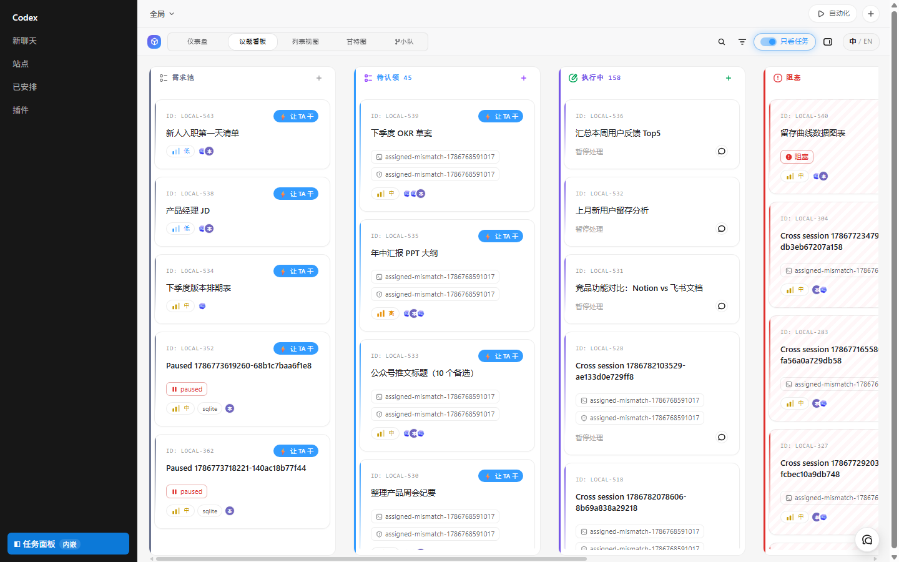
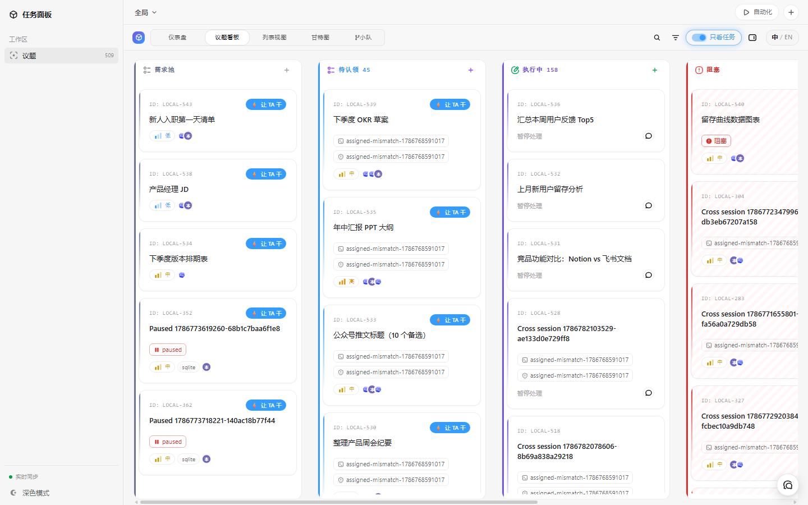
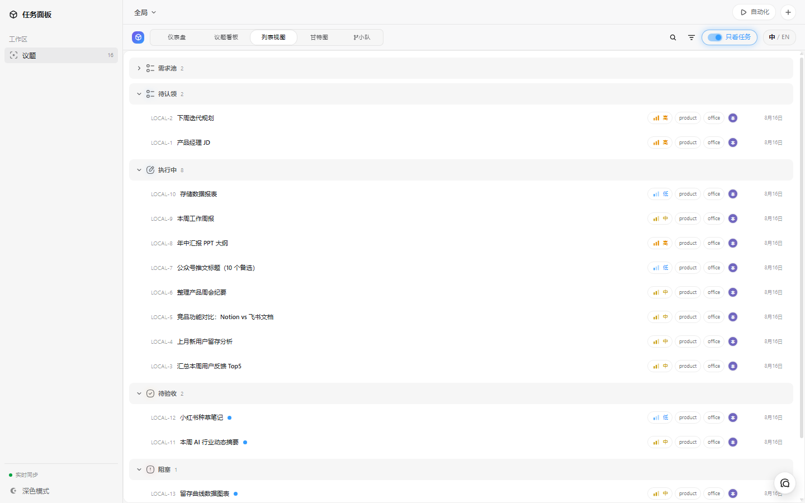
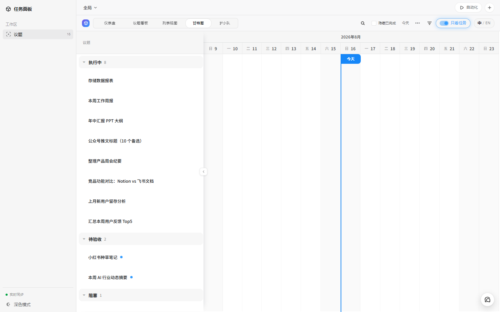
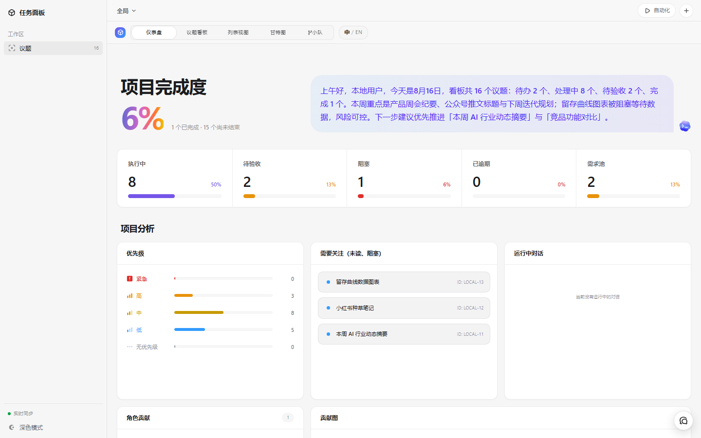
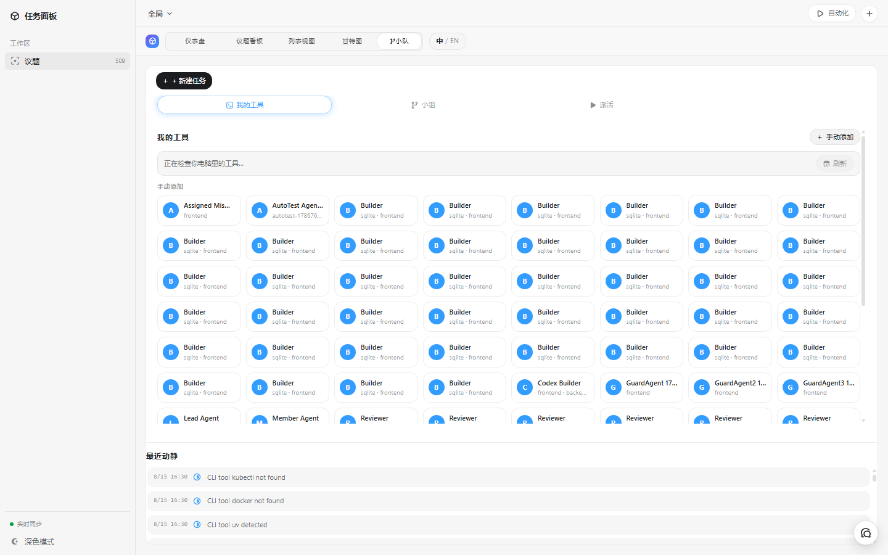
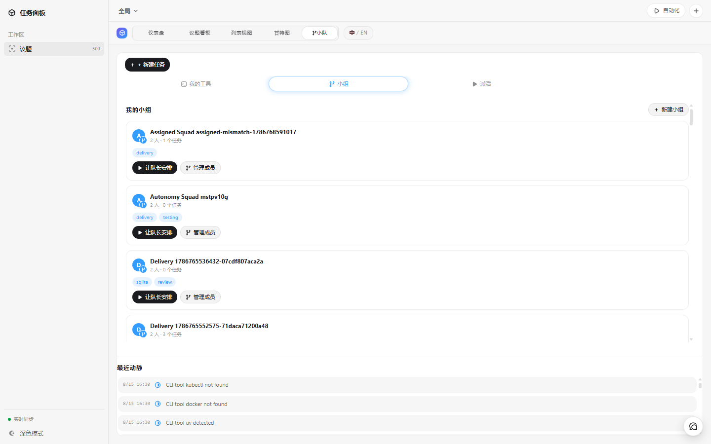
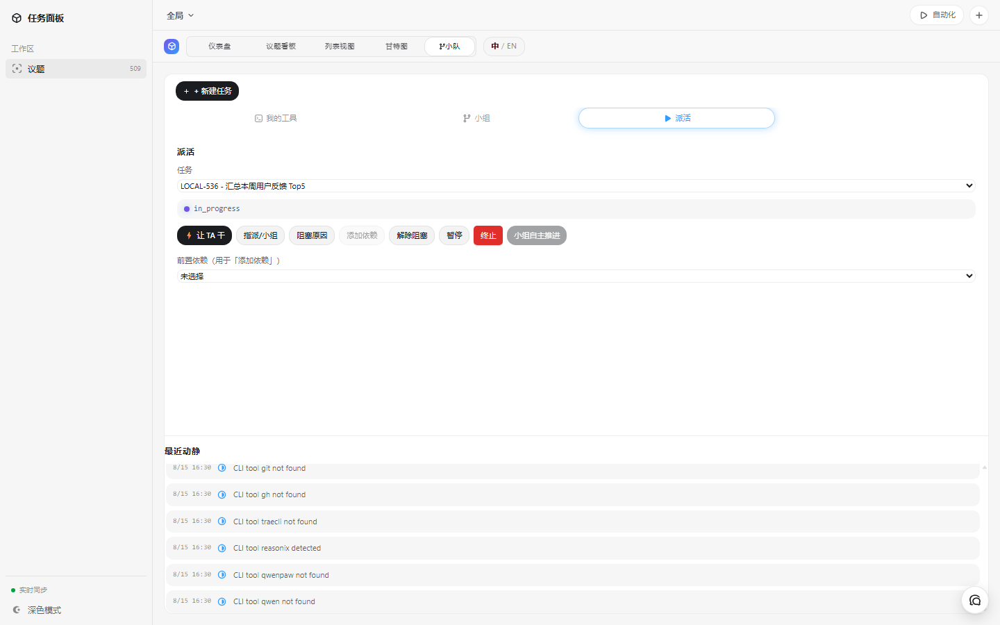
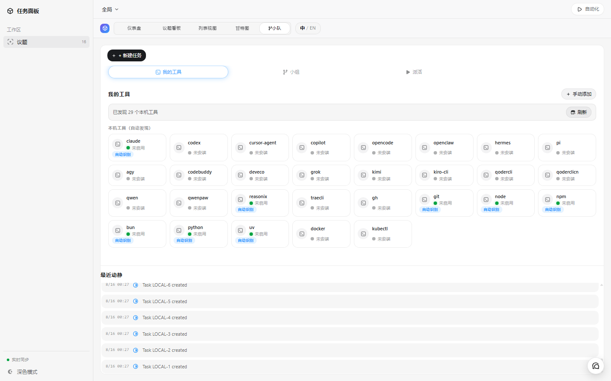

[English](README.md) | [简体中文](README.zh-CN.md)

# Codex Taskboard

一个本地优先的议题面板，可在浏览器中运行，也可通过独立 CDP 启动器或其注入脚本嵌入 Codex。同一套 HTTP API 为 React UI 和随附 Codex Skill 使用的 `taskctl` CLI 提供支持。



## 功能截图

**议题看板**（含真实办公场景的演示议题）



**列表视图 / 甘特图 / 仪表盘**

| 列表 | 甘特图 | 仪表盘 |
| --- | --- | --- |
|  |  |  |

**小队协作** — 我的工具（本机 CLI 识别）、小组（队长路由）、派活、最近动静

| 我的工具 | 小组 | 派活 | 最近动静 |
| --- | --- | --- | --- |
|  |  |  |  |

## 快速开始（用 Codex 安装）

克隆仓库并一键启动任务面板。启动脚本会在缺少依赖时自动执行 `npm install`，启动本地 Taskboard 服务，在专用 CDP 端口上启动官方 Codex App，注入 Taskboard 侧边栏入口，并保持 agent runner 运行，让智能体可以认领和执行议题。

**Windows**（双击，或从终端运行）：

```bat
git clone https://github.com/zs-13/codex-taskboard.git
cd codex-taskboard
scripts\start-taskboard.bat
```

或直接运行 PowerShell 启动脚本：

```powershell
powershell -ExecutionPolicy Bypass -File scripts\start-taskboard.ps1
```

脚本会自动从 Microsoft Store 安装中检测 Codex App。如果未找到，请通过 `-CodexAppPath` 参数或 `CODEX_TASKBOARD_CODEX_APP_PATH` 环境变量指定。

**macOS**：

```bash
git clone https://github.com/zs-13/codex-taskboard.git
cd codex-taskboard
./scripts/start-taskboard.sh
```

或者使用内置的 Codex 动作（在 macOS 上效果相同）：

```bash
npm run codex
```

**直接在 Codex 中打开：** 仓库内置了一个 Codex 环境动作（`启动`，定义在 `.codex/environments/environment.toml`），会按平台分发到对应的启动脚本（`scripts/codex-launch.mjs`）。在 Codex App 中打开克隆的文件夹并点击该动作即可启动面板。

> **Windows 一键设置（可选）：** 克隆后运行 `scripts\setup-taskboard-autostart.ps1`，会创建「Codex Taskboard」桌面快捷方式并注册常驻注入器的开机自启。之后双击该快捷方式即可打开面板，无需终端。可规避的坑见[让侧边栏面板一直可用](#让侧边栏面板一直可用避开这些坑)。

### 启动与关闭（速查）

| 操作 | 命令 |
| --- | --- |
| **启动**（Windows） | `scripts\start-taskboard.bat` |
| **启动**（macOS） | `./scripts/start-taskboard.sh` — 或 `npm run codex` |
| **一键彻底停止**（Windows） | `scripts\stop-taskboard.bat` |
| **停止**（macOS） | 在启动器终端按 `Ctrl-C` |
| **强制重启**（Windows） | `scripts\start-taskboard.bat -Force` |

单独关闭 Codex 窗口**不会**停止 Taskboard——本地服务与 agent runner 会在后台继续运行，这是有意设计，关掉窗口期间任务进度和历史仍实时同步。要彻底停止时，运行停止脚本（Windows）或在启动器终端按 `Ctrl-C`（macOS）。在 Windows 上，关窗后可能残留 `ChatGPT.exe` 占用 CDP 端口，`-Force` 会先清理残留进程再重新拉起。相关坑位见[让侧边栏面板一直可用（避开这些坑）](#让侧边栏面板一直可用避开这些坑)；想自建 Windows 启动器见 [docs/windows-launcher-setup.md](docs/windows-launcher-setup.md)。

## 如何打开任务面板（Windows / macOS）

任务面板存在于**由启动器拉起的那个 Codex 窗口的右侧侧边栏**里——它是通过 CDP 注入的，从应用图标 / 开始菜单直接打开的 Codex 窗口不会显示面板。想看面板，请始终通过下面的启动器打开 Codex。

**Windows**

1. 双击 `scripts\start-taskboard.bat`（或从终端运行）：

   ```bat
   cd codex-taskboard
   scripts\start-taskboard.bat
   ```

   完成一次性的设置后，也可以直接双击桌面上的「Codex Taskboard」快捷方式——见 `scripts\setup-taskboard-autostart.ps1`。

2. 会打开一个带任务面板的 Codex 窗口，面板在右侧侧边栏。服务和 agent runner 会一直在后台运行；关掉 Codex 窗口只是关窗口，不会关掉 taskboard。

**macOS**

1. 从终端运行启动器：

   ```bash
   cd codex-taskboard
   ./scripts/start-taskboard.sh
   ```

   或用等效的 `npm run codex`，或在 Codex 中打开本仓库文件夹后点击内置的「启动」动作。

2. 会打开一个带任务面板的 Codex 窗口，面板在右侧侧边栏。

**怎么用**

- 面板就是完整的任务看板：可以创建和移动议题，在**看板 / 列表 / 甘特图 / 仪表盘**之间切换，用**小队**分区组织智能体、小组并派活。
- 智能体（通过自带的 `manage-taskboard` skill / `taskctl` CLI）会认领并执行议题，进度和评论实时同步。
- 数据保存在本地（默认 `.data/taskboard.sqlite`），关掉 Codex 也不会丢。重启后，用同一条启动命令重新打开 Codex，面板就会回来。

**关掉 Codex 后再打开（Windows）**

> 速查命令见上文的[启动与关闭（速查）](#启动与关闭速查)。

关闭 Codex 窗口时，窗口会消失，但 **ChatGPT.exe 进程可能残留**，CDP 端口仍被占用。此时直接再跑启动器会提示「Codex CDP 已可达」而跳过启动，窗口开不出来。请用下面任一方式：

- **一键彻底停止**：运行 `scripts\stop-taskboard.bat`，会清掉本启动器拉起的 ChatGPT.exe 和后台 node 进程（服务 / 注入器 / agent runner）。之后再跑 `scripts\start-taskboard.bat` 就能重新打开窗口。
- **强制重启**：直接运行 `scripts\start-taskboard.bat -Force`，会先清理残留的 Codex（及后台进程）再重新拉起。

启动器本身也会自动处理残留：CDP 端口可达但对应 Codex 主进程已不在（或窗口已关但进程仍在）时，会先清理再重新拉起，保证新窗口一定能打开。stop 脚本只清理本启动器 profile 的 Codex，不会误杀你用应用图标/开始菜单自己开的 Codex。

如果面板没有出现，最常见的原因是用应用图标开的 Codex 而不是启动器——见[让侧边栏面板一直可用（避开这些坑）](#让侧边栏面板一直可用避开这些坑)。

## 安装为原生 Codex 插件

本仓库已按 **Codex 插件** 格式打包（`.codex-plugin/plugin.json` + 仓库级 marketplace `.agents/plugins/marketplace.json`），可以从 GitHub 链接导入，并在 Codex 的 Plugins 侧边栏中出现。自带的 `manage-taskboard` skill 会成为 Codex 智能体可用的能力。

**方式 A — 官方 CLI（最快）：**

```bash
codex plugin marketplace add zs-13/codex-taskboard
codex plugin install codex-taskboard@codex-taskboard
```

重启 Codex App 后，插件出现在 **Plugins** 下。面板单独用 `npm run codex`（或 `启动` 动作）启动。

**方式 B — 仓库自带安装器（无需 CLI）：**

```bash
# Windows
scripts\install-codex-plugin.bat

# macOS
./scripts/install-codex-plugin.sh

# 或在 Codex 中打开文件夹后点击环境动作「安装为 Codex 插件」
npm run codex:plugin:install
```

这会在 `~/.agents/plugins/marketplace.json` 注册一个个人 marketplace 指向本插件，重启 Codex 后即可从 **Plugins > Local Plugins** 一键安装。

> 说明：Codex 插件格式覆盖 skill/MCP/app；任务面板的可交互**侧边栏**仍由 CDP 注入器（`npm run codex` / `scripts/start-taskboard.*`）渲染，插件的 skill 会指导 Codex 去启动它。插件让仓库成为 Codex 的一等扩展、可被发现并安装。

> Windows 使用 CDP 端口 `9232`，macOS 使用 `9231`。如果端口被占用，可以覆盖：`scripts\start-taskboard.ps1 -Port 9231` 或 `CODEX_TASKBOARD_PORT=9231 ./scripts/start-taskboard.sh`。

## 系统要求

- Node.js 22.5 或更高版本
- 构建 macOS App 和 DMG：Xcode Command Line Tools、Rust 1.88 或更高版本，以及 `aarch64-apple-darwin` 和 `x86_64-apple-darwin` target。`npm install` 会安装本项目使用的 Tauri CLI。
- 构建 Windows NSIS：Microsoft Store 版 Codex App、Rust 1.88 或更高版本，以及带 C++ 工作负载和 Windows SDK 的 Visual Studio Build Tools。

## 本地运行

```bash
npm install
npm run build
npm start
```

打开 <http://127.0.0.1:47823>。SQLite 数据库存储在 `.data/taskboard.sqlite`。

## 本机 CLI 工具自动识别

小队面板（「我的工具」）会扫描本机已安装的开发 CLI，并把它们列为可加入小队的工具型 Agent。默认名单对齐 Multica 的 20 个 Agent CLI 运行时（`claude`、`codex`、`cursor-agent`、`copilot`、`opencode`、`openclaw`、`hermes`、`pi`、`agy`、`codebuddy`、`deveco`、`grok`、`kimi`、`kiro-cli`、`qodercli`、`qoderclicn`、`qwen`、`qwenpaw`、`reasonix`、`traecli`），外加 `gh`、`git`、`node`、`npm`、`bun`、`python`、`uv`、`docker`、`kubectl`，名单可配置：

```bash
# 逗号分隔
CODEX_TASKBOARD_CLI_TOOLS="claude,codex,gh,npx" npm start

# 或 JSON 数组
CODEX_TASKBOARD_CLI_TOOLS_JSON='["claude","codex","gh"]' npm start
```

API：`GET /api/cli-tools`（检测结果：name、command、path、version、installed、authorized），`POST /api/cli-tools/:name/authorize` / `.../revoke`。已授权的工具会以 `source: "cli"` 出现在 Agent 名录中并可加入小队。面板打开时自动扫描，也可手动刷新。

如需在前端实时重载模式下开发：

```bash
npm run dev
```

Vite UI 运行在 <http://127.0.0.1:5173>，并将 API 请求代理到本地服务。

## 使用 CLI

在项目中运行：

```bash
npm run taskctl -- project create \
  --id my-project \
  --name "My project" \
  --workspace-path /absolute/path/to/repository

npm run taskctl -- issue create \
  --project my-project \
  --title "Implement the next slice" \
  --status todo \
  --priority high \
  --labels product,mvp
```

请运行 `npm link`，以便在 shell 路径中使用 `taskctl`。设置 `CODEX_TASKBOARD_URL`，可让 CLI 指向另一个本地或局域网服务。云端部署通过**回环 companion**（本机 loopback 配套服务，不是「伴侣」）使用 `taskctl cloud login` 配置。

在 Windows PowerShell 下，含中文的标题/描述请优先通过 `--description-file`（UTF-8 文件）传入，或先执行 `chcp 65001` 并设置 `$OutputEncoding`——内联中文会被 ANSI 代码页破坏（见上文「乱码」坑位）。

## 安装 Codex Skill

将 `skills/manage-taskboard` 复制或符号链接到 Codex Skill 目录，然后启动一个新的 Codex 任务：

```bash
ln -s /absolute/path/to/codex-taskboard/skills/manage-taskboard \
  ~/.codex/skills/manage-taskboard
```

该 Skill 会指导 Codex 检查议题，将其移到 `in_progress`，使用乐观版本控制，验证工作，然后将其移到 `in_review`；只有在用户明确确认接受或要求将议题标记为完成后，才会将议题移到 `done`。

## 嵌入 Codex

### 手动：使用专用 CDP 端口

让现有 Codex 窗口保持打开。在 Taskboard 仓库中，使用专用 CDP 端口启动第二个 Codex 实例：

```bash
open -n -a /Applications/ChatGPT.app --args \
  --remote-debugging-port=9231 \
  --remote-allow-origins=http://127.0.0.1:9231
```

新 Codex 窗口出现后，在另一个终端中运行注入器：

```bash
CODEX_TASKBOARD_HOST=127.0.0.1 \
npm run codex:inject -- --port 9231 --open
```

使用嵌入式面板时，让注入器终端保持运行。原 Codex 窗口不会变化，新窗口会显示 Taskboard 侧边栏入口。如果端口 `9231` 已被占用，请在两个命令中使用另一个端口。

### 推荐：用一个命令启动独立 Taskboard 窗口

让现有 Codex 窗口保持打开，然后运行：

```bash
CODEX_TASKBOARD_HOST=127.0.0.1 npm run codex
```

该命令会在需要时启动本地 Taskboard 服务，使用独立配置文件和仅限回环访问的端口 `9231` 启动官方 macOS Codex App，等待主渲染器和侧边栏，在 Plugins 后注入一个原生外观的 Taskboard 入口，并持续监视服务和替换后的渲染器。现有 Codex 窗口不会变化。使用嵌入式面板时，请让该命令保持运行。启动器不会修改 `ChatGPT.app` 或其 `app.asar`。

源码启动器会把带身份信息的服务地址写入 `.data/launcher-runtime.json`。通过 `npm link` 安装的 `taskctl` 默认读取此文件。因此，普通 shell 和从面板打开的 Codex 任务无需设置额外环境变量，即可使用同一个 Taskboard 服务。

### macOS App：无需终端即可打开和注入

如需进行 Tauri 开发，请运行：

```bash
npm run app:dev
```

如需构建本地 App 和 DMG，请先安装两个 Rust target，然后运行构建：

```bash
rustup target add aarch64-apple-darwin x86_64-apple-darwin
npm run app:build
```

从 Finder 打开 `src-tauri/target/universal-apple-darwin/release/bundle/macos/Codex Taskboard.app`。DMG 位于 `src-tauri/target/universal-apple-darwin/release/bundle/dmg/`。如果只需安装稳定版，请从 [GitHub Releases](https://github.com/zs-13/codex-taskboard/releases/latest) 下载当前 DMG。

该 App 包含自己的 Node 运行时、Taskboard 服务、构建后的 Web UI、Skill、CLI 包装器和注入脚本。它会启动服务，启动官方 Codex App，等待渲染器，注入侧边栏入口，并在不显示终端窗口的情况下打开面板。该 App 可以复制到本检出目录之外；目标 Mac 只需安装官方 Codex App，不需要此仓库、系统 Node 安装或单独的 Codex CLI 安装。Taskboard 数据存储在 `~/Library/Application Support/Codex Taskboard`，启动器输出写入 `~/Library/Logs/Codex Taskboard/codex-taskboard-launcher.log`。

本地构建使用 ad-hoc 代码签名进行直接验证。公开的 macOS 下载仍需要 Developer ID 签名和 Apple 公证。

### Windows App：托盘启动器与内置 Taskboard

先从 Microsoft Store 安装官方 Codex App。在 Windows x64 上运行以下命令构建当前用户级 NSIS 安装包：

```powershell
npm ci
npm run app:build:windows
```

安装包位于 `src-tauri/target/x86_64-pc-windows-msvc/release/bundle/nsis/`。它包含托盘启动器、内置 Node、本地服务、构建后的 Web UI、Skill、`taskctl.cmd` 和注入脚本。Taskboard 数据存储在 `%APPDATA%\Codex Taskboard`，日志存储在 `%LOCALAPPDATA%\Codex Taskboard\Logs`，Skill 会复制到 `%USERPROFILE%\.agents\skills\manage-taskboard`。

Windows CI 产物目前有意保持未签名，也不支持自动更新。分发前请阅读[代码签名策略](docs/code-signing-policy.md)。保留数据的行为见 [Windows 卸载说明](docs/windows-uninstall.md)。

Codex 26.715.52143 的渲染器 CSP 会阻止任意 HTTP iframe。因此，启动器会启用 CDP CSP 绕过，重新加载该渲染器一次，安装文档启动脚本，并等待 Taskboard OOPIF 实际加载。同一台机器上的其他进程访问 CDP 时不需要身份验证，因此启动器运行时只能运行受信任的本地代码。

要注入一个已经通过其他方式使用 CDP 启动的 Codex 实例，请运行：

```bash
npm run codex:inject -- --port 9229 --open
```

该命令也会保持驻留，因此服务退出后，注入的标签页可以重新启动 Taskboard。使用 `Ctrl-C` 停止该命令。

该脚本会在 Codex 侧边栏添加 Taskboard 入口，并在 Codex 的整个主工作区渲染 iframe，包括上下文标题栏区域，因此 Taskboard 自己的页眉不会留下空白条。这个完整的矩形页眉位于 Electron 可拖动层之上，并标记为 `no-drag`；由于 Taskboard 活动时会隐藏原生上下文操作，它自己的操作可以使用正常的边缘内边距，不会产生人为的右侧空隙。原生侧边栏保持挂载，此前页面的选中状态和上下文页眉会暂时隐藏；选择另一个 Codex 页面会恢复它们。

“在对话中打开”会在可用时选择对应的原生 Codex 项目，并打开一个未发送的原生 composer，其中包含 `e-taskboard` 指令和议题的真实标识符。已安装的 Skill 会根据该指令隐式选中，因此 composer 不会添加 `$manage-taskboard` 提及。只有在会话实际处理该议题后，才会记录该会话的归属关系：`taskctl` 读取 Codex 的 `CODEX_THREAD_ID`，并在议题或评论变更上记录该 ID。记录的 ID 可通过 Codex 的原生路由桥接点击。每个议题可以绑定一个 Git 分支或一个 worktree；选项从所选 Codex 项目的仓库扫描，而不是手动输入。该集成使用 Codex 现有的项目、composer 和路由标记；它不会修改 React、替换 `fetch`、加载私有 chunk 或编辑 Codex 数据文件。

要使用不同的 UI 来源，请在用户脚本运行前设置 `window.__CODEX_TASKBOARD_URL__`。

## 让侧边栏面板一直可用（避开这些坑）

侧边栏面板**不是 Codex 原生插件面板**——Codex 的插件格式只覆盖 skills/MCP，不支持第三方嵌入侧边栏。面板是注入器通过 Chrome DevTools 协议（CDP）注入到「启动器用 `--remote-debugging-port` 参数拉起的 Codex 窗口」里的。下面是最常踩的坑和规避方法：

1. **用启动器打开 Codex，不要用应用图标。** 从开始菜单/图标正常打开的 Codex 窗口不会启用 CDP，注入器挂不上去，面板不会出现。请始终用 `scripts\start-taskboard.bat`（Windows）或 `./scripts/start-taskboard.sh` / `npm run codex`（macOS）打开带面板的 Codex 窗口。

2. **关闭再打开 Codex 会清掉面板。** 面板活在 Codex 窗口内部，重启窗口就会消失。常驻注入器会在同一端口上检测到带调试端口的 Codex 重新出现时自动重新注入——只要用启动器重新打开 Codex，面板就会自己回来。如果关掉窗口后残留进程占着端口、导致重新打开失败，先运行 `scripts\stop-taskboard.bat` 再启动，或直接用 `scripts\start-taskboard.bat -Force`。

3. **只跑一个 Taskboard。** 不要每次换一个 CDP 端口启动。每换一个端口/配置，就会多出一个 Codex 窗口、一个注入器、一个服务，且各自使用独立的 `.data\taskboard.sqlite`，历史任务在不同实例之间会「看起来丢失」。请固定使用一个端口（Windows `9232`、macOS `9231`）。启动器是幂等的——重复运行只会复用已在运行的服务、注入器和 Codex，不会重复拉起。

4. **服务有意比 Codex 活得更久。** 关掉 Codex 后服务和 agent runner 仍在后台运行，这正是实时任务进度和历史记录能持续的原因。关闭 Codex 不会删除任务。要彻底停止，运行 `scripts\stop-taskboard.bat`（Windows）——它会清掉本启动器拉起的 ChatGPT.exe 和后台 node 进程（服务 / 注入器 / agent runner）；或禁用开机自启。

5. **Windows 一键设置（可选）。** 运行 `scripts\setup-taskboard-autostart.ps1` 会创建「Codex Taskboard」桌面快捷方式（固定端口启动器）并注册常驻注入器的开机自启，安装后双击即可打开面板，重启电脑也能自动就绪。

6. **任务管理器里出现十几个 `ChatGPT.exe`/`codex` 是正常的。** Codex 桌面应用基于 Chromium，一个窗口会拆成多个系统进程：主浏览器进程 + GPU、网络、存储、崩溃上报（crashpad）、以及每个标签页/面板一个渲染进程。它们共用同一个进程名，所以单个 Codex 窗口在任务管理器里会显示为 10+ 条。判断「是不是只开了一个」看主进程：只有一个**不带 `--type=`**（且带 `--user-data-dir=` 和 `--remote-debugging-port=`）的 `ChatGPT.exe` 就只有一个窗口。启动器还会在后台常驻几个 `node.exe`（服务、注入器、agent runner），这是有意设计——关掉 Codex 后任务进度和历史仍持续更新。

7. **中文标题/描述变成 `��ϲ` 这样的乱码。** 在中文 Windows 上，PowerShell 5.1 向原生命令（`taskctl`、`multica`、`node` 等）传参时使用 ANSI 代码页（GBK / cp936）编码，**内联或管道输入的中文在到达 Taskboard 之前就已经被破坏了**。Taskboard 只会按 UTF-8 原样存储收到的内容、不会二次转码，所以「到达即乱码」的标题会一直乱码。当需要在 Windows PowerShell 下创建含中文的 issue/任务/评论时：
   - **优先用文件传参**——`--description-file <file>` / `--content-file <file>`（把文件保存为 UTF-8），而不是内联/管道中文。`cli/taskctl.mjs` 以 UTF-8 读取这些文件，内容能完好送达。
   - **或者先强制整段会话用 UTF-8**——在调用 `taskctl` / `multica` 前先执行 `chcp 65001` 和 `$OutputEncoding = [System.Text.Encoding]::UTF8`。
   自带的启动脚本（`scripts/start-taskboard.ps1`、`setup-taskboard-autostart.ps1`、`install-codex-plugin.ps1`）已强制 UTF-8，覆盖它们自身的输出和原生命令管道。

## 配置

| 变量 | 默认值 | 用途 |
| --- | --- | --- |
| `CODEX_TASKBOARD_HOST` | `0.0.0.0` | HTTP 绑定地址；使用 `127.0.0.1` 可禁用局域网访问 |
| `CODEX_TASKBOARD_PORT` | `47823` | 本地 HTTP 端口 |
| `CODEX_TASKBOARD_DATA_DIR` | `.data` | SQLite 数据目录 |
| `CODEX_TASKBOARD_URL` | `http://127.0.0.1:47823` | CLI API 源地址 |
| `CODEX_TASKBOARD_AUTO_EXECUTE` | `1` | 任务被智能体认领（或指派给具体智能体）后，自动启动一个无头 Codex 回合，让任务真正开始执行，无需手动打开对话。设为 `0` 则回到手动「在对话中打开」。每个任务还可通过「自动执行」开关（新建/编辑）覆盖全局默认值。 |

开启自动执行后，被认领的任务会经历 `executionState`（`claimed` → `running` → `completed`/`failed`/`interrupted`）。任务卡片与详情面板会展示该状态，无头智能体也会把进度评论实时写入任务，无需打开对话即可查看。

`npm start` 会输出本地 URL 和可用的局域网 URL。同一受信任网络中的协作者可以打开其中一个局域网 URL，并使用同一个 Taskboard 服务。任务、评论和附件变化通过服务器发送事件广播到所有打开的客户端；客户端重连后会执行完整刷新，因此不会遗漏断开连接期间发生的变化。使用 `taskctl` 的协作者可以通过 `CODEX_TASKBOARD_URL=http://<host-ip>:47823` 指向共享服务。

局域网模式没有账户身份验证：受信任本地网络中任何能访问该 URL 的人都可以读取和写入 Taskboard。公网和云端部署需要经过身份验证的部署边界。

## 通过 Cloudflare 共享

对于两名受信任的协作者，Taskboard 可以在 Cloudflare 上运行，使用 Worker Static Assets 和 API 路由，以 D1 作为权威业务数据库，并使用私有 R2 bucket 存储附件。该部署使用带共享密码的 HTTPS Basic 身份验证，并在全局修订号变化后刷新已打开的面板。

每台设备保留自己的项目检出映射，并继续使用**本地 companion**（本机配套服务 / 环回代理）提供 Codex、Git/worktree、Skill 和 MCP 能力。请勿将 companion 译为「伴侣」，也不要把普通 Taskboard HTTP 接口称为「伴侣 API」。云端模式绝不会回退到本地 SQLite 数据库，也不会同时写入本地数据库。

请参阅[云端协作](docs/cloud-collaboration.md)，了解所有者部署、现有 GitHub 安装设置、密码轮换、本地路径映射和一次性本地数据迁移流程。

## 验证

```bash
npm run check
```

该命令会运行 TypeScript 检查、生产前端构建、组件测试，以及服务器/CLI/注入测试套件。

## 议题 Markdown

议题描述和评论支持 GFM，包括表格和任务列表。`mermaid` 围栏代码块会在查看器加载后渲染成只读图；渲染失败时仍可阅读原始图表源码。Markdown HTML 注释（例如 `<!-- trace-analysis:v1 ... -->`）不会出现在渲染后的正文中，且不会启用原始 HTML。
